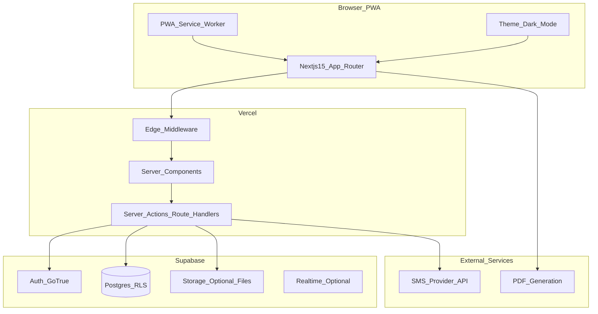
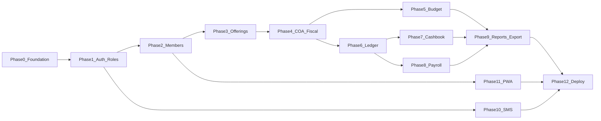

# Church Management System — Development Plan

## Assumptions (adjust if your context differs)

- **Single congregation** per deployment (one logical “church”). Schema includes an optional `organizations` row so you can grow to multi-site later without a rewrite.
- **SMS** via a provider-agnostic integration (e.g. Twilio or regional gateway); secrets live in Vercel env vars.
- **Accounting**: general ledger uses **double-entry** (debits/credits); cashbook is an operational register that **creates or links to** ledger postings for consistency.
- **Church calendar / Sunday** for role-specific behaviour (e.g. Mzee wa kanisa recording windows) uses **`CHURCH_TIMEZONE`** (IANA, default `Africa/Nairobi`) in server-rendered offerings logic so hosted UTC does not disagree with the congregation’s local Sunday.

---

## High-level architecture



**Security model**: Supabase Row Level Security (RLS) enforces role-based access; Next.js server-only code uses the **service role** only for tightly scoped admin jobs (e.g. cron, bulk SMS), never exposed to the client. Normal requests use the user’s JWT so RLS applies.

**Role matrix (summary — ChMS as implemented)**

| Capability | admin | treasurer | pastor | assistant_pastor | committee_head | church_elder (Mzee) | jumuiya_chairman | member |
|------------|:-----:|:---------:|:------:|:----------------:|:--------------:|:-------------------:|:----------------:|:------:|
| Members CRUD / directory | yes | yes | pastoral view | pastoral view | — | — (nav: finance only) | jumuiya-scoped view | self / linked row |
| Offerings page + weekly / collective / other pledges | yes | yes | — | yes | yes (Sunday + batch rules in UI; **org-wide member lookup** for recording) | — | My offerings |
| Batch authorize (committee) | yes | — | — | yes | — | — | — |
| Batch approve (treasurer) | yes | yes | — | — | — | — | — |
| Ledger / cashbook | yes | yes | no | no | no | no | no |
| Budget / payroll | yes | yes | no | planning chair subset | no | no | no |
| Reports / export | yes | yes | pastoral / jumuiya reports | offering reports where applicable | — | jumuiya reports | own optional |
| User / role admin | yes | no | no | no | no | no | no |

**Mzee wa kanisa and members:** Jumuiya assignment still models pastoral care scope, but **recording offerings** requires resolving any member by offering number in the org. RLS policies `members_select_church_elder_org` and `profiles_select_church_elder_org` grant **SELECT** on all org `members` / `profiles` for `church_elder` so search and inserts are not limited to assigned jumuiya. Sunday-only (or treasurer-waiting) behaviour remains in **application** checks on the offerings routes and actions.

*(“Pastoral fields” = visitation notes, groups, sacramental records if you add them later.)*

---

## Recommended repository file structure

Repository layout (ChMS codebase under project root):

```text
src/
  app/
    (auth)/login/...
    (dashboard)/layout.tsx
    (dashboard)/members/...
    (dashboard)/offerings/...
    (dashboard)/finance/
      budget/...
      ledger/...
      cashbook/...
      payroll/...
    (dashboard)/reports/...
    (dashboard)/settings/...
    api/
      webhooks/...          # optional: SMS delivery callbacks
      export/...            # if streaming large exports
    manifest.ts             # or public/manifest.json for PWA
    globals.css
    layout.tsx
  components/
    ui/                     # shadcn primitives
    members/
    finance/
    layout/
  lib/
    supabase/
      client.ts             # browser client
      server.ts             # server client + cookies
      middleware.ts
    auth/
      roles.ts
      permissions.ts
    finance/
      ledger.ts             # posting helpers, validation
    sms/
      client.ts
    exports/
      pdf.ts
      excel.ts
  types/
    database.types.ts       # generated from Supabase
  hooks/
middleware.ts               # auth session refresh, route guards
public/
  icons/                    # PWA icons
supabase/
  migrations/               # SQL migrations
  seed.sql                  # optional dev seed
```

Supporting root files: `next.config.ts` (PWA plugin or manual SW), `tailwind.config.ts`, `components.json` (shadcn), `.env.local` / Vercel env vars, `eslint` + `prettier`.

---

## Database schema (PostgreSQL / Supabase)

**Core identity & roles**

- `organizations` — id, name, settings (JSON), created_at (optional multi-tenant anchor).
- `profiles` — id (FK `auth.users`), org_id, full_name, phone, avatar_url, preferences (JSON, includes theme if stored server-side).
- `app_role` — enum includes at least: `admin`, `treasurer`, `pastor`, `assistant_pastor`, `member`, `committee_head`, `church_elder`, `jumuiya_chairman` (extend via migrations as needed).
- `user_roles` — user_id, role, org_id; users can hold multiple roles per org.

**Members & offerings**

- `households` / **jumuiya** — groupings; optional `chairperson_user_id`; links to `jumuiya_chair_assignments`, `jumuiya_elder_assignments` for scoped pastoral UI (dashboard currently surfaces up to 2 elders per jumuiya member context).
- `members` — id, org_id, user_id (nullable), household_id (nullable), `offering_number` (unique per org when set), status, join_date, contact fields, `member_details` JSON (Swahili-facing profile fields, jumuiya labels, etc.).
- `offering_types` — id, org_id, name (Ahadi, Jengo, collective types, etc.).
- `offering_week_batches` — id, org_id, `week_start_date` / `week_end_date` (Sun–Sat), `batch_slot` (sequential rounds per week), `status` (`pending_authorization` → `authorized` → `approved` / `rejected`), audit columns, `affected_rows`.
- `offerings` — id, org_id, member_id (nullable for collective lines), offering_type_id, amount, currency, received_at, recorded_by, `batch_id` (FK to `offering_week_batches`), budget posting flags as needed.
- `member_other_pledges` — non-standard pledges; supports registered and unregistered contributors (`member_id` nullable with `full_name` fallback), includes `paid_amount`, and links to `batch_id` for the same authorization workflow as other offering lines.

**Finance — fiscal & budget**

- `fiscal_years` — id, org_id, label, start_date, end_date, is_closed.
- `budgets` — id, org_id, fiscal_year_id, name, status (draft/approved).
- `budget_lines` — id, budget_id, account_id, amount, notes.

**Chart of accounts & general ledger (double-entry)**

- `accounts` — id, org_id, code, name, type (asset/liability/equity/revenue/expense), parent_id (nullable), is_active.
- `journal_entries` — id, org_id, entry_date, description, source_type (`manual` | `offering` | `cashbook` | `payroll` | `system`), source_id (nullable), created_by, posted_at.
- `journal_lines` — id, journal_entry_id, account_id, debit, credit, memo (CHECK: one of debit/credit > 0 per line; sum debits = sum credits per entry).

**Cashbook**

- `cashbook_accounts` — id, org_id, name, account_id (FK to `accounts` for the linked GL cash/bank account), opening_balance, as_of_date.
- `cashbook_transactions` — id, org_id, cashbook_account_id, txn_date, amount, direction (in/out), payee_payor, category, memo, created_by; optional `journal_entry_id` when posted to GL.

**Payroll**

- `employees` — id, org_id, member_id (nullable link), name, role_title, base_salary or hourly, tax identifiers as appropriate, active flag.
- `payroll_runs` — id, org_id, period_start, period_end, status, journal_entry_id (nullable when posted).
- `payroll_lines` — id, payroll_run_id, employee_id, gross, deductions JSON or normalized tables, net, notes.

**SMS & audit**

- `sms_messages` — id, org_id, to_phone, body, status, provider_id, error, sent_at, created_by.
- `audit_log` (optional) — table_name, record_id, action, old_row, new_row, actor_id, at.

**Indexes & RLS**: index foreign keys and common filters (`org_id`, `txn_date`, `member_id`). Enable RLS on all tenant tables; policies compare `auth.uid()` to `user_roles` / `profiles` and `org_id`.

---

## Phases, milestones, and task breakdown

### Phase 0 — Project foundation

- Initialize Next.js 15 App Router + TypeScript + ESLint; add Tailwind and shadcn/ui; configure path aliases.
- Add Supabase project; wire [`src/lib/supabase`](src/lib/supabase) server/browser clients; [`middleware.ts`](middleware.ts) for session refresh.
- Environment variables on Vercel: `NEXT_PUBLIC_SUPABASE_URL`, `NEXT_PUBLIC_SUPABASE_ANON_KEY`, `SUPABASE_SERVICE_ROLE_KEY` (server-only), SMS keys, etc.
- Theming: `next-themes` (or shadcn pattern) for **dark mode**; verify contrast in both themes.

### Phase 1 — Authentication & authorization

- Auth UI (email magic link or password per your choice); protected `(dashboard)` layout.
- Sync `auth.users` → `profiles` (trigger or signup callback).
- Role assignment UI (admin only); `user_roles` maintenance.
- Centralize **permission checks** in [`src/lib/auth/permissions.ts`](src/lib/auth/permissions.ts); use in Server Actions and RLS-aligned UI hiding.

### Phase 2 — Members module

- CRUD for `members`; search/filter; optional link to `auth.users` for “member portal.”
- Households / jumuiya: `households` + FK from `members`; chairs and **Mzee wa kanisa** assignments for display and scoped defaults.
- Member profile pages; offering number; member cards / import paths as built.

### Phase 3 — Offerings

- `offering_types` CRUD (admin); **unified week batches** — one open batch per church week until authorized/approved; sequential `batch_slot` for mid-week rounds after approval.
- Weekly grid (by offering number), collective lines, **other pledges** with debounced member search; Swahili batch labels (e.g. Jumapili vs katikati ya wiki).
- Workflow: committee **authorize** → treasurer **approve** or **reject**; RLS aligned with `committee_head`, `treasurer`, `church_elder`.
- **Church elder:** offerings UI and server actions gated by church-local Sunday where required; **member search** uses org-wide `members` / `profiles` read policies so recording is not limited to elder’s jumuiya.
- Optional: post consolidated offering **journal entry** (revenue + cash/bank) via Server Action for ledger alignment.

### Phase 4 — Chart of accounts & fiscal years

- `accounts` tree UI; seed default COA for churches (donations, expenses, cash, etc.).
- `fiscal_years` management; prevent edits when closed (app logic + RLS).

### Phase 5 — Annual budgeting

- `budgets` / `budget_lines` tied to `fiscal_year_id` and `accounts`.
- Approval workflow (draft → approved); treasurer/admin.
- Budget vs actual report queries (join `budget_lines` with aggregated `journal_lines` by period).

### Phase 6 — General ledger

- Journal entry UI (balanced lines); listing and detail views.
- Posting from offerings/cashbook/payroll (automated `journal_entries` with `source_type`).
- Period locking aligned with `fiscal_years`.

### Phase 7 — Cashbook

- `cashbook_accounts` and register UI (running balance).
- “Post to ledger” action creating linked `journal_entry`.
- Reconciliation checklist (optional later): statement date, cleared flag on transactions.

### Phase 8 — Payroll

- `employees` CRUD; `payroll_runs` with `payroll_lines`.
- Generate net pay and posting entry (expense + liability + cash/bank).
- Payslip PDF (subset of Phase 9).

### Phase 9 — Reports & export

- Reports: member directory, offerings by period/type, income statement, budget vs actual, cashbook summary, payroll summary.
- **PDF**: `@react-pdf/renderer` or server-side HTML→PDF (choose one stack early).
- **Excel**: `exceljs` or `xlsx` in Route Handlers / Server Actions with streaming for large datasets.
- Role-gated report routes.

### Phase 10 — SMS notifications

- Abstraction [`src/lib/sms/client.ts`](src/lib/sms/client.ts); log to `sms_messages`.
- Triggers: optional event-based (e.g. offering receipt, meeting reminder) from Server Actions or Supabase Edge Functions if you prefer DB-triggered sends.
- Rate limiting and opt-in stored on `profiles` or `members`.

### Phase 11 — PWA & mobile polish

- Web app manifest, icons, meta theme color aligned with dark mode.
- `next-pwa` or `@ducanh2912/next-pwa` (evaluate compatibility with Next 15) or manual service worker scope limited to offline shell + cache static assets.
- Touch-friendly tables (responsive cards or horizontal scroll); critical flows usable on phones.

### Phase 12 — Production hardening & Vercel

- RLS policy review; security advisor fixes; least-privilege service role usage.
- Backups (Supabase dashboard); optional Point-in-Time Recovery on paid tier.
- Vercel: production branch, env vars, preview deployments for PRs.
- Monitoring: Vercel Analytics + Supabase logs; error boundary and user-facing error pages.

---

## Dependency graph (conceptual)



---

## Risk notes (short)

- **Financial correctness**: enforce balanced journals in DB (constraint or trigger) and in app validation.
- **RLS complexity**: add integration tests or SQL policy tests as tables grow.
- **SMS cost/compliance**: opt-in and quiet hours; never expose provider secrets to the client.
- **PWA + auth**: ensure auth session refresh works when returning from background.

---

## What you will do first after approving this plan

Scaffold Phase 0 (Next.js + Supabase + shadcn), apply initial migration for `profiles`, `user_roles`, and `organizations`, then implement Phase 1 before building feature screens.

---

## ChMS implementation status (snapshot)

The codebase has completed Phases 0–12 at a functional level, with Tanzania-oriented UX (TZS, Swahili copy), offering batch workflow, and extended RBAC. Recent extensions include: assistant pastor role support, dual-elder display per jumuiya on member dashboard, and other-pledges support for unregistered congregants (plus paid/balance fields). Ongoing work is iterative: RLS reviews when adding tables, new env vars (`CHURCH_TIMEZONE`), and `supabase db push` whenever new migrations land (including elder org-wide read for offerings: `20260421120000_members_profiles_select_church_elder_offerings.sql` and role/pledge extensions from 2026-04-20).
