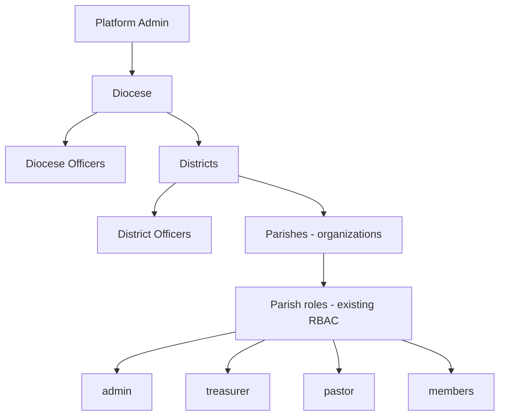
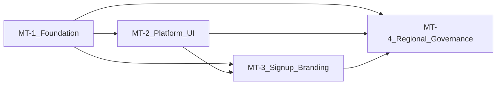

# ChMS Multi-Parish Platform — Development Plan

**Parent plan:** [`chms_full_stack_plan_d23278b2.plan.md`](chms_full_stack_plan_d23278b2.plan.md) (Phases 0–12 complete)

**Production constraint:** The existing live parish (default org `00000000-0000-4000-8000-000000000001`) must continue unchanged until each MT phase is explicitly deployed. All MT work is **additive** (new tables, new routes, new policies)—no data migration of the live parish.

---

## Confirmed product decisions

| Topic | Decision |
|-------|----------|
| Platform admin | Single operator (you) — full platform control |
| Pastor / member email | **One email → one parish at a time** — transfers close old access, open new (no dual-parish pastors) |
| Platform team multi-parish | **Exception:** parish operators on your team may switch parish context across assigned parishes |
| Roll-up reports (initial) | **Totals only** — no member-level export across parishes except registry search (see below) |
| Parish branding | Each parish **name + logo** in app header |
| Signup | **Per-parish join link** — not a shared open signup |
| Feature modules | Platform admin **enables/limits features per parish** (e.g. M-Pesa, SMS, payroll) |
| Code vs config | Git deploys **shared code**; parish behaviour controlled by **org settings + feature flags** |

---

## Governance hierarchy



### Regional officer roles (new — not parish `user_roles`)

These live in **separate assignment tables** scoped to `diocese_id` or `district_id`, not `org_id`. One auth user may hold at most one regional role set per diocese/district (same email rule applies globally).

**Diocese level**

| Role key | Swahili / label | Primary access |
|----------|-----------------|----------------|
| `diocese_bishop` | Askofu | Diocese dashboard; all diocese roll-ups; registry search across diocese parishes |
| `diocese_general_secretary` | Katibu Mkuu wa Dayosisi | Demographic roll-ups; registry search; parish list (metadata) |
| `diocese_treasurer` | Mhasibu wa Dayosisi | Financial totals roll-ups across diocese; no parish ledger detail |
| `diocese_committee_head` | Mwenyekiti wa Kamati (Dayosisi) | Demographic + planning roll-ups as policy defines per committee type |

**District level**

| Role key | Swahili / label | Primary access |
|----------|-----------------|----------------|
| `district_head` | Mkuu wa Jimbo | District dashboard; all district roll-ups; registry search across district parishes |
| `district_secretary` | Katibu wa Jimbo | Demographic roll-ups; registry search; parish list |
| `district_treasurer` | Mhasibu wa Jimbo | Financial totals roll-ups across district |
| `district_committee_head` | Mwenyekiti wa Kamati (Jimbo) | Demographic + planning roll-ups as policy defines |

**Platform admin** sits above all levels and can assign regional officers, provision parishes, toggle features, and see all totals.

**Parish operator (platform team exception)** — not a regional officer; can impersonate/switch into assigned parishes for support. Stored in `platform_parish_operators (user_id, org_id)`.

---

## Access matrix (summary)

| Capability | Platform admin | Diocese officers | District officers | Parish admin | Pastor / member |
|------------|:--------------:|:----------------:|:-----------------:|:------------:|:---------------:|
| Provision / suspend parish | yes | no | no | no | no |
| Per-parish feature flags | yes | no | no | no | no |
| Parish operational screens | via operator switch | no | no | own parish | own parish |
| Demographic roll-ups | all dioceses | own diocese | own district | own parish | no |
| Financial totals roll-up | all | own diocese | own district | own parish detail | no |
| Registry search by name | all parishes | diocese parishes | district parishes | own parish only | no |
| Registry result fields | parish + status | parish + status | parish + status | full member record | self only |

**Registry search result (regional officers):** match name (fuzzy) → `full_name`, `parish_name`, `member_status` (active/inactive), `offering_number` optional. **No** jumuiya details, offerings history, or pastoral notes from other parishes.

---

## Architecture (unchanged stack)

One **Next.js app** on Vercel + one **Supabase project** + many **organizations (parishes)**. Isolation via RLS on `org_id`. Regional access via new RLS policies keyed on `diocese_id` / `district_id` through join to `organizations`.

```text
src/app/
  platform/           # MT-2 — platform admin only
  regional/
    diocese/          # MT-4 — diocese officers
    district/         # MT-4 — district officers
  join/[slug]/        # MT-3 — parish signup
  (dashboard)/        # existing — parish users (header shows parish logo/name)
```

---

## Database additions (all phases)

### Hierarchy

```sql
-- Conceptual (exact names in migration)
dioceses (id, name, code, settings, created_at)
districts (id, diocese_id, name, code, created_at)
organizations -- extend existing
  + district_id FK
  + slug (unique, for /join/{slug})
  + display_name, logo_url
  + timezone (IANA)
  + fiscal_year_start_month
  + status (active | suspended | provisioning)
  + settings.features jsonb
```

### Identity & roles

```sql
platform_admins (user_id, created_at)
platform_parish_operators (user_id, org_id)  -- platform team only

diocese_officers (id, diocese_id, user_id, role, created_at)
  -- role enum: diocese_bishop | diocese_general_secretary | ...

district_officers (id, district_id, user_id, role, created_at)
  -- role enum: district_head | district_secretary | ...
```

### Demographics for roll-ups

Ensure `members.member_details` (or normalized columns added in MT-1) supports reliable aggregation:

| Field | Used for |
|-------|----------|
| `gender` | women / men counts |
| `date_of_birth` or `age` | children, youth bands (configurable age ranges) |
| `is_orphan` / `marital_status` | orphans, widows |
| `status` | active vs inactive in registry search |

Age bands (defaults, configurable per diocese): e.g. child 0–12, youth 13–35 — store as diocese `settings.demographic_bands`.

### Views / functions for reporting (MT-4)

- `report_parish_demographics(org_id)` — single parish counts
- `report_district_demographics(district_id)` — sum of parish counts in district
- `report_diocese_demographics(diocese_id)` — sum across diocese
- `search_member_registry(scope_type, scope_id, query)` — SECURITY DEFINER, returns limited columns only

All report functions enforce caller’s regional role or platform admin before returning rows.

### Parish provisioning (`provision_parish()`)

Server-side function (SECURITY DEFINER + service role from platform action) creates:

1. `organizations` row with metadata from form
2. Default chart of accounts (from seed template)
3. Default committees (Evangelism, Planning, Malezi, Diaconic, Environmental)
4. Default offering types
5. Initial fiscal year from account year input
6. Travel certificate org settings (diocese name pre-filled)
7. Storage bucket path prefix for parish logo / note media (existing bucket pattern)
8. Optional: invite token for first parish `admin`

**Does not** copy members or finance data from other parishes.

### Feature flags (`organizations.settings.features`)

```json
{
  "module_offerings": true,
  "module_finance": true,
  "module_payroll": false,
  "module_travel_certificates": true,
  "module_sms": false,
  "offerings_mpesa": false,
  "member_import": true
}
```

App nav and server actions check flags before exposing functionality. Code for M-Pesa may exist globally; flag controls visibility and execution per parish.

---

## MT-Phase 1 — Foundation (no parish-user-visible change)

**Goal:** Database and security ready; live parish unaffected.

### Tasks

1. **Migrations:** `dioceses`, `districts`, extend `organizations`, officer tables, `platform_admins`, `platform_parish_operators`.
2. **Backfill:** Assign current live parish to a diocese/district (manual seed row — e.g. “Dayosisi ya Dodoma” / default district) without changing `org_id`.
3. **`provision_parish()`** SQL + seed templates extracted from `supabase/seed.sql`.
4. **RLS hardening:** Update `user_has_any_role`, `user_is_admin`, etc. to require `user_roles.org_id = current_org_id()`.
5. **One email rule:** Constraint/trigger — one `profiles` row per `auth.users.id`; parish transfer = update `profiles.org_id` + revoke old roles + audit log (no concurrent multi-parish profile).
6. **Demographics audit:** Document and normalize fields in `member_details` for roll-up queries; add missing flags (`is_orphan`, `is_widow`, DOB) via migration if absent.
7. **Helper functions:** `current_user_platform_admin()`, `current_user_diocese_scope()`, `current_user_district_scope()`, `org_has_feature(key)`.

### Exit criteria

- Migrations apply cleanly on production with zero change to existing parish UX.
- `provision_parish()` works in staging creating an empty fully-seeded parish.
- Role checks scoped to org in SQL tests.

---

## MT-Phase 2 — Platform admin & parish lifecycle

**Goal:** You can manage parishes and features from a platform dashboard.

### Tasks

1. **Routes:** `/platform` layout (platform admin guard), `/platform/parishes`, `/platform/parishes/new`, `/platform/parishes/[id]`.
2. **Parish form fields:** Diocese, district (or create district), parish name, slug, account year start, timezone, logo upload, first admin email.
3. **Actions:** Create parish → call `provision_parish()` → show join link + admin invite.
4. **Feature flag UI:** Toggles per parish on parish detail page.
5. **Platform roll-up reports:** Totals-only dashboard — parish count by district/diocese, aggregate member counts, aggregate offering totals (high level).
6. **Parish operator access:** Assign your team users to multiple `platform_parish_operators` orgs; context switcher in platform UI (not available to pastors).
7. **Suspend parish:** Set `status = suspended` — block login except platform admin.

### Exit criteria

- You can add a second test parish end-to-end without touching parish #1 data.
- Feature flag hides a module on test parish only.

---

## MT-Phase 3 — Parish access, signup & branding

**Goal:** Each parish has its own front door; default-org open signup closed.

### Tasks

1. **`/join/[slug]`** — public page with parish logo/name; signup passes `org_id` / slug in auth metadata.
2. **Update `handle_new_user()`** — read parish from signup metadata; reject signup without valid parish slug; never default to org `…0001` for new public signups.
3. **Disable generic `/signup`** or redirect to “contact your parish” unless platform admin invite.
4. **Dashboard header** — load `organizations.display_name` + `logo_url` for current parish.
5. **Pastor transfer workflow (platform or parish admin):** deactivate member at parish A, create/reactivate at parish B, single profile org reassignment, audit trail.
6. **Invite first parish admin** — email link scoped to parish on provision.

### Exit criteria

- Two parishes have different join URLs and isolated signup flows.
- Existing parish users still log in normally; their header shows their parish branding.
- New public user cannot accidentally join parish #1.

---

## MT-Phase 4 — Diocese & district governance

**Goal:** Regional officers access scoped reports and registry search.

### Tasks

1. **Officer assignment UI** (platform admin): assign users to diocese/district roles; invite flow if user has no account.
2. **Routes:** `/regional/diocese` and `/regional/district` with role-based guards (user may hold one diocese role OR one district role per scope — clarify in UI).
3. **Demographic reports pages:**
   - Counts: children, women, men, youth (by configurable bands), orphans, widows, total members, active vs inactive.
   - Filters: by parish within scope (for breakdown tables — still aggregates, not individual rows except registry search).
4. **Financial totals (totals only):** offerings received (period), optional budget summary totals — diocese/district treasurer views only.
5. **Registry search:** name search across parishes in scope; results table: name, parish, active/inactive; rate-limit and audit log searches.
6. **RLS policies** on underlying data or strictly use SECURITY DEFINER report functions (preferred — no direct cross-org table SELECT for regional users).
7. **Export:** CSV/PDF of **aggregate tables only** for regional officers (not member lists).

### Exit criteria

- Diocese secretary can see diocese-wide orphan count and search a name → parish + status.
- District treasurer sees district offering totals without opening parish ledgers.
- Parish A admin cannot see parish B data or regional dashboards.

---

## Signup & URL model (reference)

| URL | Audience |
|-----|----------|
| `/login` | All authenticated users |
| `/join/{parish-slug}` | New members of that parish only |
| `/platform/*` | Platform admin (+ operators for assigned parishes) |
| `/regional/diocese/*` | Diocese officers |
| `/regional/district/*` | District officers |
| `/dashboard/*` | Parish-level users |

Example join links (generated on provision):

```text
https://chms-prod.vercel.app/join/kanisa-la-mt-maria-dodoma
https://chms-prod.vercel.app/join/kanisa-la-petro-morogoro
```

---

## How parish-specific features (e.g. M-Pesa) work

1. **Develop** payment integration once in shared codebase (server action + UI component).
2. **Gate** with `org_has_feature('offerings_mpesa')` in nav, page, and action.
3. **Configure** Paybill / API keys in `organizations.settings.mpesa` (parish A only).
4. **Deploy** to Vercel — all parishes get the code; only enabled parishes see and use it.
5. **Platform admin** toggles flag per parish.

No per-parish git branches. No separate Vercel projects per parish.

---

## Dependency graph



MT-2 and MT-3 can partially overlap after MT-1; MT-4 depends on hierarchy, demographics, and at least one additional parish for testing.

---

## Risk notes

| Risk | Mitigation |
|------|------------|
| RLS leaks across parishes | Prefer SECURITY DEFINER report functions for regional access; SQL policy tests per phase |
| Regional officer sees too much PII | Registry search returns minimal fields; audit searches |
| `user_has_any_role` without org scope | Fixed in MT-1 before multi-parish go-live |
| Pastor transfer data leak | Transfer closes old parish membership; pastoral history stays in old org |
| Feature flag bypass | Server actions always re-check flags, not just UI |
| Demographic data quality | Parish admins responsible for member profile completeness; reports show “unknown” bucket |

---

## Implementation order (after plan approval)

1. **MT-Phase 1** — migrations + security (start here).
2. **MT-Phase 2** — platform dashboard so you can create parish #2 safely.
3. **MT-Phase 3** — signup isolation before onboarding real new parishes publicly.
4. **MT-Phase 4** — diocese/district officers and reports once multiple parishes exist for testing.

---

## Related files (existing)

- `supabase/migrations/20260411000000_initial_schema.sql` — `organizations`, `current_org_id()`, RLS baseline
- `supabase/migrations/20260414003000_signup_seed_autolink.sql` — `handle_new_user()` (hardcoded default org — replaced in MT-3)
- `supabase/seed.sql` — COA, committees, offering types template for `provision_parish()`
- `src/lib/auth/permissions.ts` — extend with platform + regional permission helpers
- `src/components/layout/dashboard-header.tsx` — parish logo/name (MT-3)
